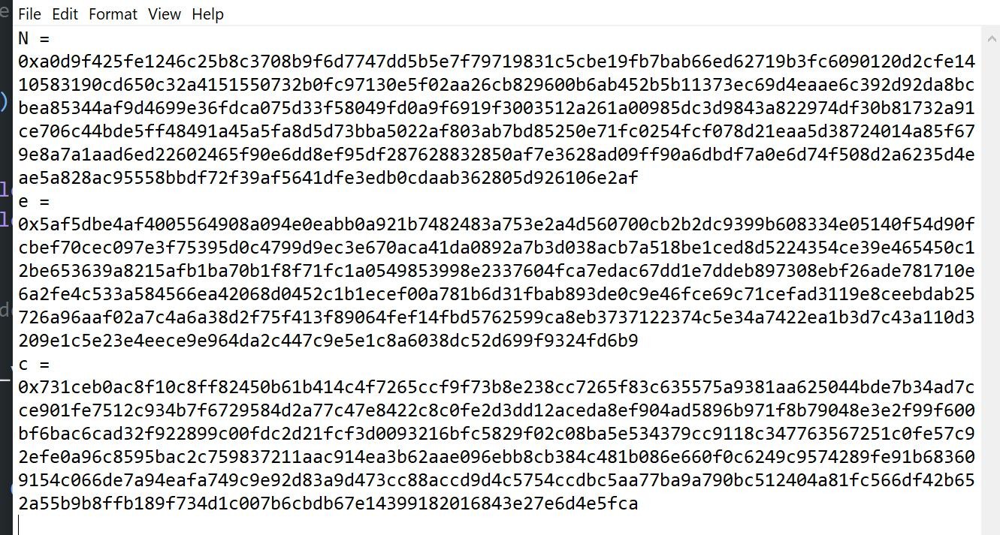
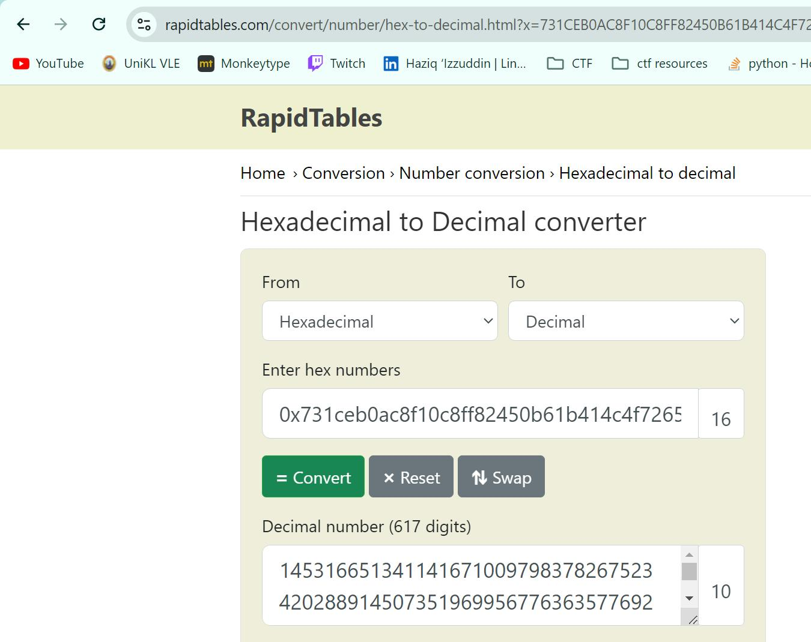
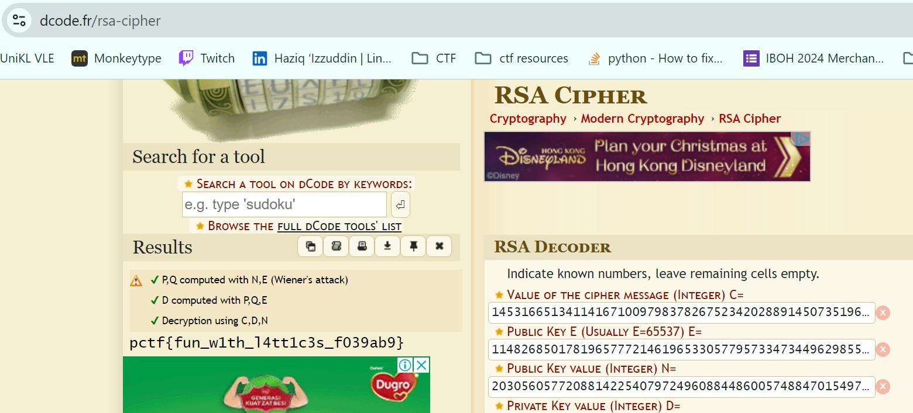

# Bigger is Better

Solved by: @Zeqzoq

- Category: crypto
- Description: I heard choosing a small value for e when creating an RSA key pair is a bad idea. So I switched it up!

- Challenge File: dist.txt

### Solution:

1. Open the challenge file

2. Change all the hex to decimal with online decoder

3. Result:

**Flag:** `pctf{fun_w1th_l4tt1c3s_f039ab9}`

