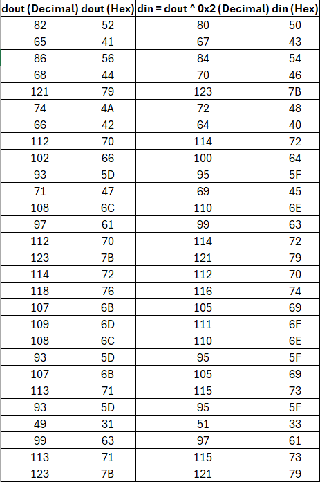
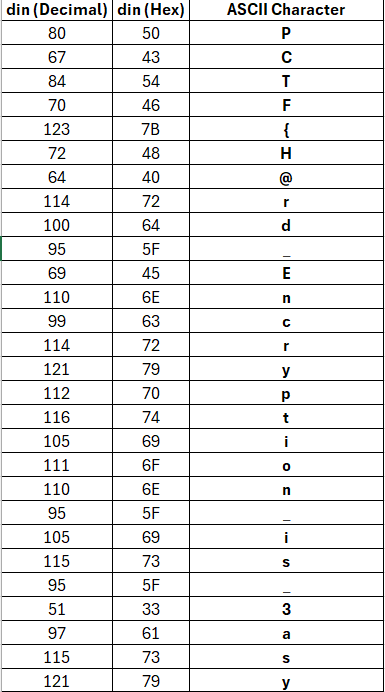

# RTL Easy

Solved by: @okay

- Category: misc
- Description: They said they added a layer of encryption, do you think you can still get in?
- Challenge File: top.v, flag.svg

### Solution:

1. Python script to simulate this process and observe the results of dout for different inputs (din). The goal is to find the correct sequence of bits or patterns that result from the bitwise operations and correspond to the SVG.

```py
def simulate_bitwise_operations(din):
    # Apply the Verilog operations step by step
    temp = (din & 0x3FF) << 2 ^ 0xA
    dout = (temp >> 2) & 0xFF
    return dout
# Test with different din values
for din in range(256):  # For all 8-bit values
    dout = simulate_bitwise_operations(din)
    print(f"din: {hex(din)} -> dout: {hex(dout)}")
```

2. From the flag.svg, we can see a series of dout values displayed as hexadecimal numbers. 
```
0h52, 0h41, 0h56, 0h44, 0h79, 0h4a, 0h42, 0h70, 0h66, 0h5d, 0h47, 0h6c,
0h61, 0h70, 0h7b, 0h72, 0h76, 0h6b, 0h6d, 0h6c, 0h5d, 0h6b, 0h71, 0h5d,
0h31, 0h63, 0h71, 0h7b
```

3. Remove the 0h

```
52, 41, 56, 44, 79, 4A, 42, 70, 66, 5D, 47, 6C,
61, 70, 7B, 72, 76, 6B, 6D, 6C, 5D, 6B, 71, 5D,
31, 63, 71, 7B
```

4. Convert dout Hex Values to Decimal
Reverse the Bitwise Operation. 
From earlier findings, we deduced that: `dout = din ^ 0x2`

to find din:
`din = dout ^ 0x2`

after that compute din for each dout value **(first image)**
then convert din values to ASCII **(second image)**




**Flag:** `PCTF{H@rd_Encryption_is_3asy}`


