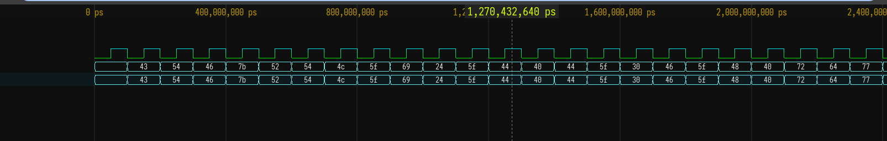

# RTL Warm Up

Solved by: 

- Category: misc
- Description: Let's Warm up. Spartan's wanted to create their own ASIC, to secure doors. One of the spy was able to extract the simulation file, can you find the password to the door?

Note: The space are _

- Challenge File: flag.vcd

### Solutions:

1. Use [vc.drom.io](https://vc.drom.io/) to upload the vcd file



2. Notice the hex value and decode it to get the flag

```sh
echo "4354467B52544C5F69245F4440445F30465F48407264774072337D" | xxd -p -r
```

**Flag:** `CTF{RTL_i$_D@D_0F_H@rdw@r3}`

