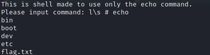

# Really Only Echo

Solved by: @Cookies to SELL

- Category: misc
- Description: Hey, I have made a terminal that only uses echo, can you find the flag?
- Challenge File: server.py

### Solutions:

`#` is not blacklisted



```
Please input command: l\s # echo
bin
boot
dev
etc
flag.txt
home
lib
lib64
media
mnt
opt
proc
root
run
sbin
srv
sys
tmp
usr
var
```

To cat the flag out:
```
Please input command: ca\t f* # echo
pctf{echo_is_such_a_versatile_command}
```

**Flag:** `pctf{echo_is_such_a_versatile_command}`

