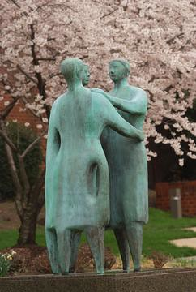

# Night School

Solved by: @PLSSKY

- Category: OSINT
- Description:

It's said that a famous geocacher has left a cache on our Fairfax campus. He took this picture before disappearing into the night. Could you help us find where this picture was taken?

The flag is pctf{NAME\_OF\_STATUE}

Challenge Image:

### Solutions: 

Based on the description, it has a clue of `left a cache on our Fairfax campus` which indicate that the statue locate at George Mason Campus

With Google Dorking (`George Mason Campus intext:"statue"`), will get us to a [flickr page](https://www.flickr.com/photos/masoninnconferencecenter/5668950865/) 

This is the image:

Next, reverse search on this image will bring us to this [page](https://www.gmu.edu/discover-mason) which tells us the details of the statue

#screenshot image

**Flag:** `pctf{Communitas}`

