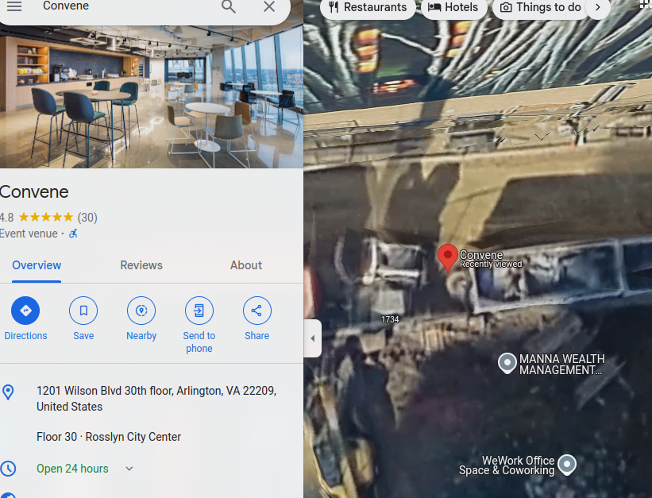

# On The Run

Solved by: @hikki

- Category: OSINT
- Description: 

We've been tracking the adversary for weeks, and he just slipped up and posted this gorgeous high-rise view on his Twitter. His caption was "awesome meeting with a gorgeous view!" Can you track down his location?

Flag format will be PCTF{<business name of his location>}. Not a street address. If he were in a WeWork space, it would be PCTF{wework}.

Challenge Image:

### Step 1: Reverse Image Search

With Google reverse image search, many result show similar images showing the location originates [here](https://www.google.com/maps/place/1100+Wilson+Blvd+Suite+900,+Arlington,+VA+22209,+USA/@38.8954298,-77.0734981,340a,35y,90h,39.42t/data=!3m1!1e3!4m6!3m5!1s0x89b7b7df522b7abd:0xb68677505b0e9f31!8m2!3d38.8948322!4d-77.0704495!16s%2Fg%2F11k4k4lsnm?entry=ttu&g_ep=EgoyMDI0MDkxOC4xIKXMDSoASAFQAw%3D%3D) in Google Maps.

### Step 2: Find the Business Location where the images was taken from

Result: [Convene](https://maps.app.goo.gl/8tttgXcX8RBHraCH9)

**Flag:** PCTF{Convene}

