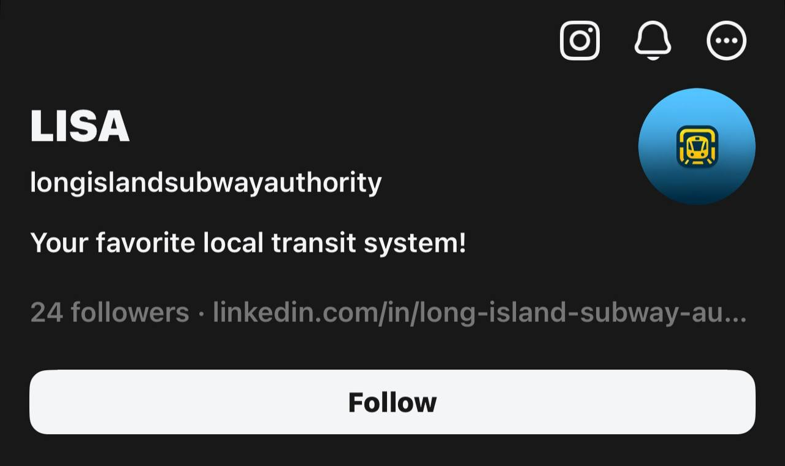
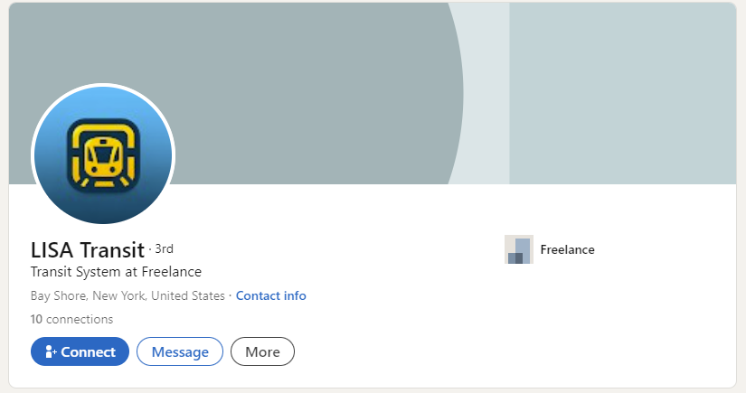
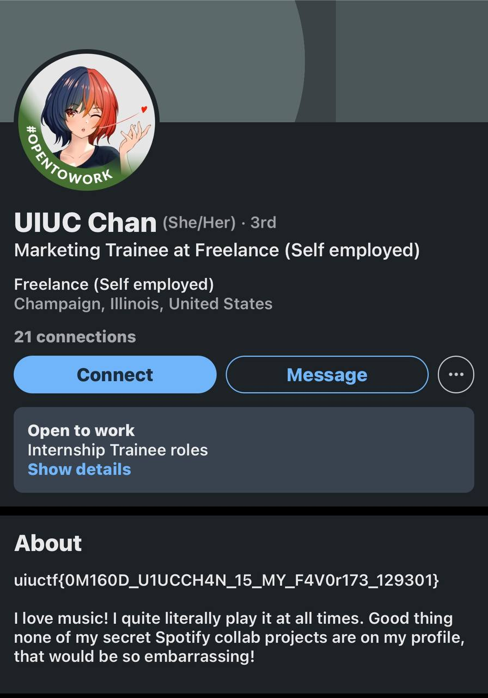

# OSINT - An Unlikely Partnership
Solved by **WanYin**

## Question
It appears that the Long Island Subway Authority (LISA) has made a strategic business partnership with a surprise influencer! See if you can figure out who.

This is part two of a three-part OSINT suite including Hip With the Youth, An Unlikely Partnership, and The Weakest Link. This challenge is possible without Hip With the Youth but will be easier if you start there.

## Solution
On their Threads account, We found a LinkedIn profile.

Visit the LinkedIn profile linked in the Threads account.

We are aiming for individuals who are related to or have worked with LISA. We found a suspicious account from the endorsements.

The flag is found on the profile that has endorsed LISA.

### Flag
uiuctf{0M160D_U1UCCH4N_15_MY_F4V0r173_129301}