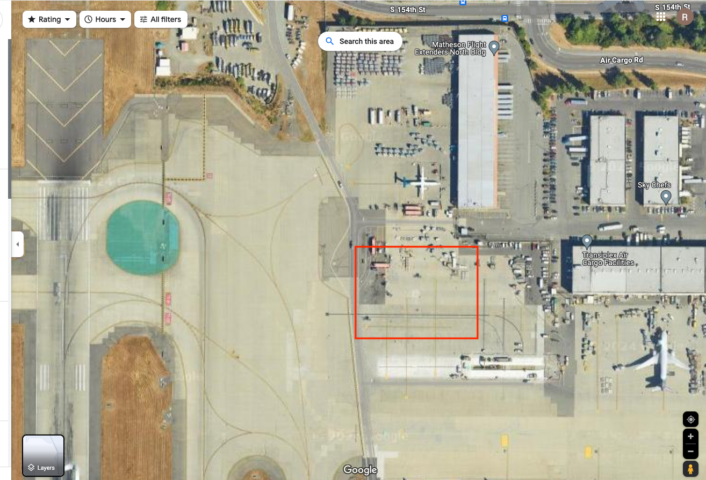

# OSINT - Chunky Boi
Solved by **warlocksmurf & yappare**

## Question
Now that's a BIG plane! I wonder where it is. Flag format: uiuctf{plane type, coordinates of the aircraft} Example: uiuctf{Airbus A380-800, 40.036, -88.264}

For coordinates, just omit the digits, do not round up. Precision is the same as the one in the example. The aircraft name is the same as Wikipedia page title. You can extract enough information from this image to answer this. You DO NOT need to register any accounts, all the information is public.

Flag format clarification: The last digit of the first coordinate is even, and the last digit of the second coordinate is odd.

## Provided File

## Solution
Used Google Maps to locate the area as the warehouse looks the same, but the grass area didn't match perfectly. However, this is how we can confirm the location, making it likely that it is the area near Seattle Airport.
https://www.google.com/maps/search/seattle+airport+air+force/@47.4605295,-122.3068376,87m/data=!3m1!1e3?entry=ttu

Further search made us confirm that this is it 
https://www.google.com/maps/search/seattle+airport+air+force/@47.4605295,-122.3068376,87m/data=!3m1!1e3?entry=ttu

Based on the image and location, and after conducting some research, the aircraft is identified as a Boeing C-17 Globemaster III. After attempting different coordinates, we finally managed to pinpoint the correct location.

### Flag
uiuctf{Boeing C-17 Globemaster III, 47.462, -122.303}

