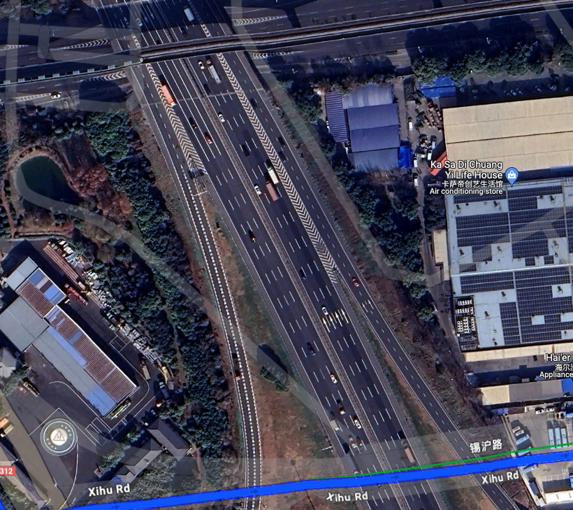

# OSINT - New Dallas
Solved by **yappare**

## Question
Super wide roads with trains... Is this the new Dallas? Flag format: uiuctf{coordinates of intersection between the rail and the road} Example: uiuctf{41.847, -87.626}

Flag format clarification: Use three decimal points of precision, truncate, and do not round. Use Google Maps location for reference. The last digit of the first coordinate is odd, and the last digit of the second coordinate is even.

## Provided File

## Solution
Initially, the suspected location was identified near Shanghai, China, based on the presence of wide roads, train tracks, and specific landmarks like a blue building rooftop.
https://www.google.com/maps/place/31°13'09.4"N+121°28'00.2"E/@31.2187081,121.4666204,221a,35y,270h/data=!3m1!1e3!4m10!1m5!3m4!2zMzHCsDE0JzA0LjQiTiAxMjHCsDI3JzI0LjQiRQ!8m2!3d31.234567!4d121.456789!3m3!8m2!3d31.219282!4d121.466718!5m1!1e4?entry=ttu

Further investigation gives some potential locations such as Shanghai Metro Line 2, Wuxi Line 2, or Shenzhen.
https://rail.kychung.com/en/category/chinese-metro-rails/

After multiple attempts to pinpoint different coordinates by exploring various intersections and landmarks using resources like maps, metro system details, and videos, the correct coordinates were identified as `31.579, 120.388`.

https://www.google.com/maps/dir/Shangmadun+Residential+District,+Liangxi+District,+Wuxi,+Jiangsu,+China,+214003/IKEA,+Xishan+District,+Wuxi,+Wuxi,+China/@31.5786105,120.3837615,256m/data=!3m1!1e3!4m14!4m13!1m5!1m1!1s0x35b38e11348bb96f:0x9448930c94f36636!2m2!1d120.328087!2d31.583824!1m5!1m1!1s0x35b3917fb884a61f:0xfa3dd93eedacca5f!2m2!1d120.392663!2d31.581156!5i2!5m1!1e2?authuser=0&hl=en-MY&entry=ttu

## Flag 
`uiuctf{31.579, 120.388}`
