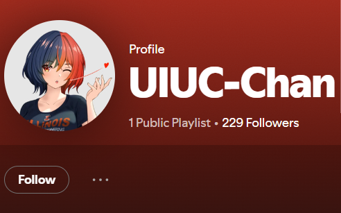

# OSINT - The Weakest Link
Solved by **WanYin**

## Question
LISA and the secret business partner have a secret Spotify collaboration planned together. Unfortunately, neither of them have the opsec to keep it private. See if you can figure out what it is!

This is part three of a three-part OSINT suite including Hip With the Youth, An Unlikely Partnership, and The Weakest Link. I recommend starting with the other two challenges!

## Solution
Follow the below Spotify user

Open the Spotify app and check your friend activity (the web version does not show friend activity). Look for a playlist called “songs for train lovers” that is collaborated on by LISA and UIUC-Chan. The flag is in the description of the “songs for train lovers” playlist.

### Flag
`uiuctf{7rU1Y_50N65_0F_7H3_5UMM3r_432013}`

