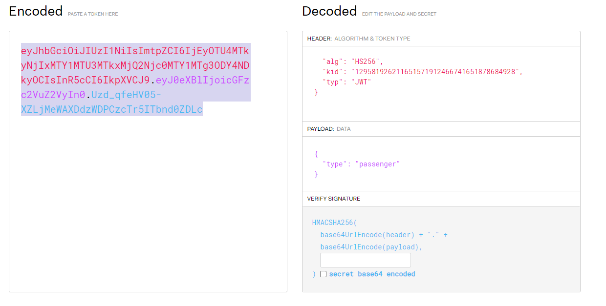
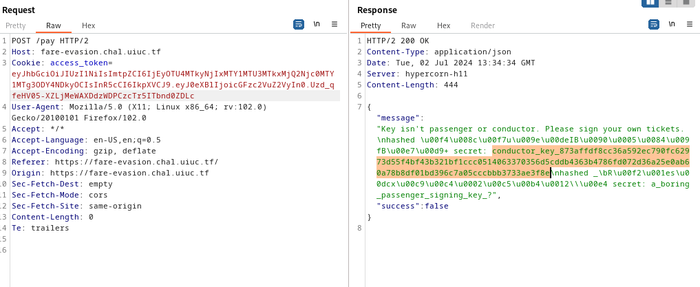
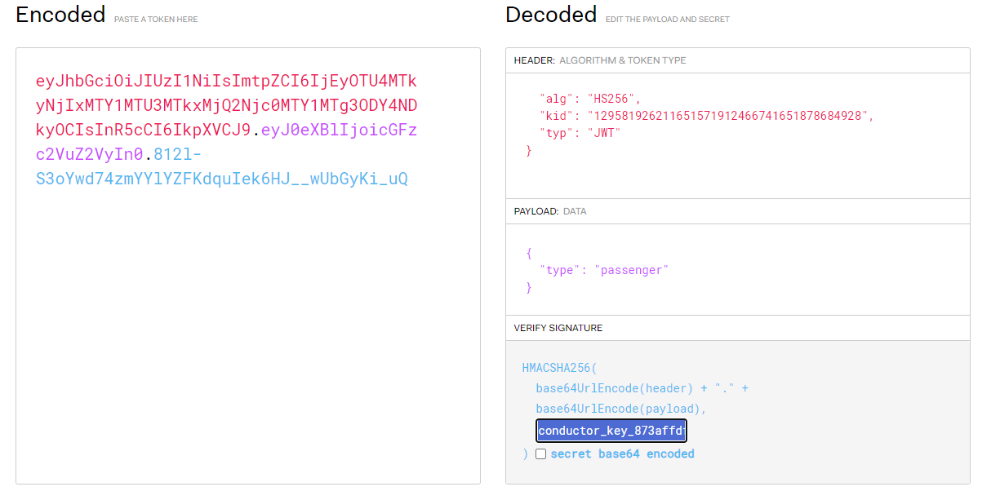
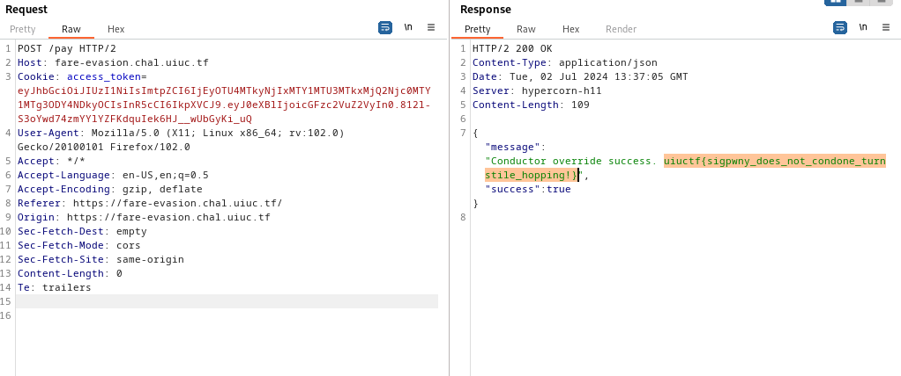

# Web - Fare Evasion
Solved by **Shen**\
Original Writeup: https://chuajianshen.github.io/2024/06/29/UIU2024/

## Question
SIGPwny Transit Authority needs your fares, but the system is acting a tad odd. We'll let you sign your tickets this time!

## Solution

Understanding the Application:

```javascript
  <script>
    async function pay() {
      // i could not get sqlite to work on the frontend :(
      /*
        db.each(`SELECT * FROM keys WHERE kid = '${md5(headerKid)}'`, (err, row) => {
        ???????
       */
      const r = await fetch("/pay", { method: "POST" });
      const j = await r.json();
      document.getElementById("alert").classList.add("opacity-100");
      // todo: convert md5 to hex string instead of latin1??
      document.getElementById("alert").innerText = j["message"];
      setTimeout(() => { document.getElementById("alert").classList.remove("opacity-100") }, 5000);
    }
  </script>
```

- The application uses JWT tokens and provides a signing key for passengers.
- There is an SQL Injection vulnerability in the `kid` header.
- The `kid` header uses md5 encoding as latin-1 instead of hex.
- Using SQL Injection through the `kid` header, you can exploit the application to leak sensitive data.

Googling around and Found this [article](https://cvk.posthaven.com/sql-injection-with-raw-md5-hashes) which explains the problem and is similar to the challenge.

Change the `kid` header to the md5 hash 129581926211651571912466741651878684928 to exploit the SQL Injection and leak the conductor key. 


This md5 hash (as latin-1) will execute the SQL injection and reveal the key.


Once you have the conductor key, use it to sign a new JWT token as an admin or conductor.


Use this forged token to authenticate as a conductor and obtain the flag.


### Flag
`uiuctf{sigpwny_does_not_condone_turnstile_hopping!}`
