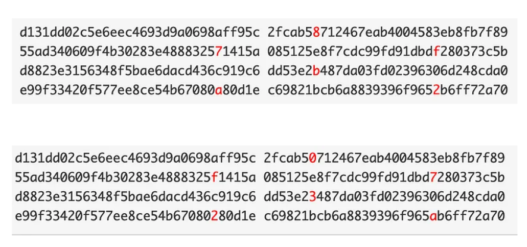

# Same but Different

Solved by: @hikki

## Question:

In the world of cryptography, not everything is what it seems. You've stumbled upon a cryptic note that contains 79054025255fb1a26e4bc422aef54eb4
There are two hex strings related to this. What sets them apart?
Flag format: ironCTF{hexstring1\_hexstring2}

## Solution:

79054025255fb1a26e4bc422aef54eb4 (famous md5 hash collision)

References: [medium blogpost](https://medium.com/asecuritysite-when-bob-met-alice/reusable-hash-collisions-9bac4413cd19)

The difference between hex1 and hex2:

**Flag:** `ironCTF{87fba2_0f732a}`

