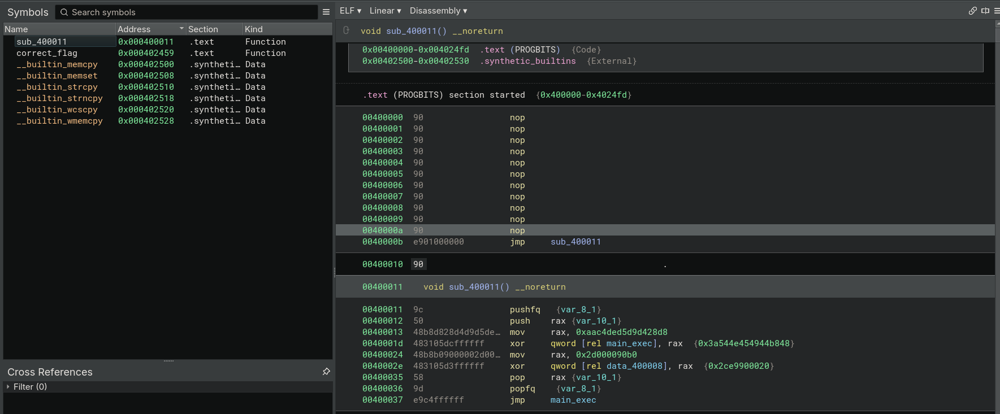
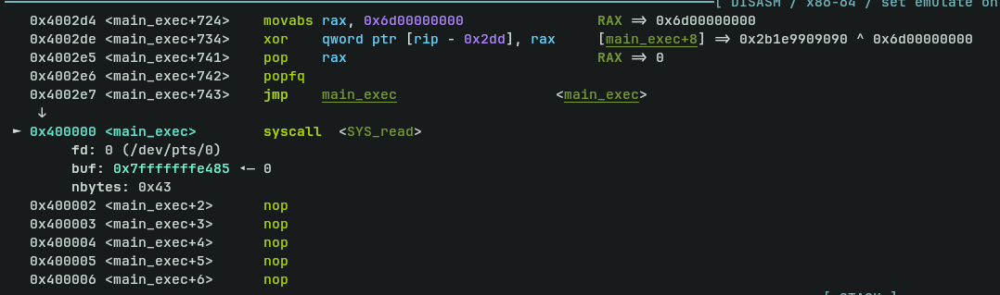

1.  Run `readelf -s` to  inspect the symbols table 
```sh
$ readelf --symbols bake_and_forth 

Symbol table '.symtab' contains 7 entries:
   Num:    Value          Size Type    Bind   Vis      Ndx Name
     0: 0000000000000000     0 NOTYPE  LOCAL  DEFAULT  UND 
     1: 0000000000000000     0 FILE    LOCAL  DEFAULT  ABS /tmp/tmp2f60wsfd[...]
     2: 0000000000400000     0 NOTYPE  LOCAL  DEFAULT    1 main_exec
     3: 0000000000402459     0 NOTYPE  LOCAL  DEFAULT    1 correct_flag
     4: 00000000004024a1     0 NOTYPE  LOCAL  DEFAULT    1 wrong_flag
     5: 00000000004024ee     0 NOTYPE  LOCAL  DEFAULT    1 exit
     6: 00000000004024f8     0 NOTYPE  GLOBAL DEFAULT    1 _start
```

The output showing the binary is abnormal as normally `_start` would be the entry point of the binary and should be at a lower address and followed by main and the rest of the functions. So we should disassembly 

2. Disassemble the binary 


Upon initial static analysis with Binary Ninja, we notice from the address 0x400000 to 0x40000a are filled with NOPs and it jumps to address 0x400011. 

Here is the disassembly from 0x400011:
```nasm
00400011    void sub_400011() __noreturn

00400011  9c                 pushfq   {var_8_1}
00400012  50                 push    rax {var_10_1}
00400013  48b8d828d4d9d5de…  mov     rax, 0xaac4ded5d9d428d8
0040001d  483105dcffffff     xor     qword [rel main_exec], rax  {0x3a544e454944b848}
00400024  48b8b09000002d00…  mov     rax, 0x2d000090b0
0040002e  483105d3ffffff     xor     qword [rel data_400008], rax  {0x2ce9900020}
00400035  58                 pop     rax {var_10_1}
00400036  9d                 popfq    {var_8_1}
00400037  e9c4ffffff         jmp     main_exec
```
Key information at this function is that usage of `pushfq`, `popfq` and `xor` operations being used indicating process of unpacking. 

3. Use gdb to debug the binary 
- `b *0x0000000000400011`
- `ni` 
Continue this process until you saw `SYS_READ` being executed 



Hit until you observe the "test" string is in rbx 

The next instruction that unpacked is just `mov al, byte ptr [rbx]` which is taking one byte from the string into AL register and then `cmp al, 0x$$`. The `$$` is the value of the flag string in byte. 

Here is the first compare instruction:


In AL register containing 0x74 which is the letter `t` in ascii and the intended value is 0x62 which  is letter `b`, also the beginning letter of the flag header. 

To pass by the condition checking, just `set $al=0x62`

Here is the full bypass set instruction:
```
set $al=0x62
set $al=0x65
set $al=0x72
set $al=0x73
set $al=0x75
set $al=0x6e
set $al=0x6e
set $al=0x65
set $al=0x72
set $al=0x7b
set $al=0x74
set $al=0x68
set $al=0x33
set $al=0x5f
set $al=0x74
set $al=0x33
set $al=0x6d
set $al=0x70
set $al=0x33
set $al=0x72
set $al=0x34
set $al=0x74
set $al=0x75
set $al=0x72
set $al=0x33
set $al=0x5f
set $al=0x31
set $al=0x35
set $al=0x5f
set $al=0x72
set $al=0x31
set $al=0x73
set $al=0x31
set $al=0x6e
set $al=0x67
set $al=0x5f
set $al=0x63
set $al=0x34
set $al=0x75
set $al=0x73
set $al=0x33
set $al=0x5f
set $al=0x77
set $al=0x33
set $al=0x27
set $al=0x72
set $al=0x33
set $al=0x5f
set $al=0x68
set $al=0x6f
set $al=0x74
set $al=0x5f
set $al=0x68
set $al=0x30
set $al=0x74
set $al=0x5f
set $al=0x68
set $al=0x30
set $al=0x37
set $al=0x5f
set $al=0x48
set $al=0x30
set $al=0x37
set $al=0x5f
set $al=0x48
set $al=0x4f
set $al=0x54
set $al=0x7d
```

Flag: `brunner{th3_t3mp3r4tur3_15_r1s1ng_c4us3_w3'r3_hot_h0t_h07_H07_HOT}`
