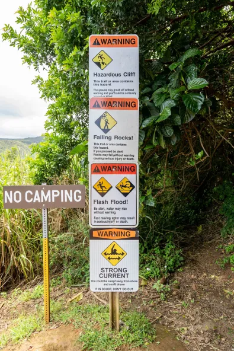

# Danger Searching 

Solved by: @ace999
### Question:
My friend told me that they hiked on a trail that had 4 warning signs at the trailhead: Hazardous cliff, falling rocks, flash flood, AND strong currents! Could you tell me where they went? They did hint that these signs were posted on a public hawaiian hiking trail.

Note: the intended location has all 4 signs in the same spot. It is 4 permanent distinct signs - not 4 warnings on one sign or on a whiteboard.

Note: Feel free to try multiple plus codes. The answer skews roughly one "plus code tile" south/west of where many people think it is.

Flag is the full 10 digit [plus code](https://plus.codes/map) **containing the signs they are mentioning**, (e.g. lactf{85633HC3+9X} would be the flag for Bruin Bear Statue at UCLA). The plus code is in the URL when you select a location, or click the `^` at the bottom of the screen next to the short plus code to get the full length one. If your plus code contains 3 digits after the plus sign, zoom out and try selecting again.
### Solution:
1. Find the list of public trails in hawaii in this [link]([https://hawaiitrails.ehawaii.gov/trails/#/](https://hawaiitrails.ehawaii.gov/trails/#/ "https://hawaiitrails.ehawaii.gov/trails/#/))
2. Next filter the trails based on the warning of the trails, and if you put all 4 of the warning given, it shows only 1 trail with all of the warnings, which is Pololu trial and you can find the plus code from using the address.
3. This is the picture that have all 4 warnings:

**Flag:** `lactf{73G66738+9C}`

