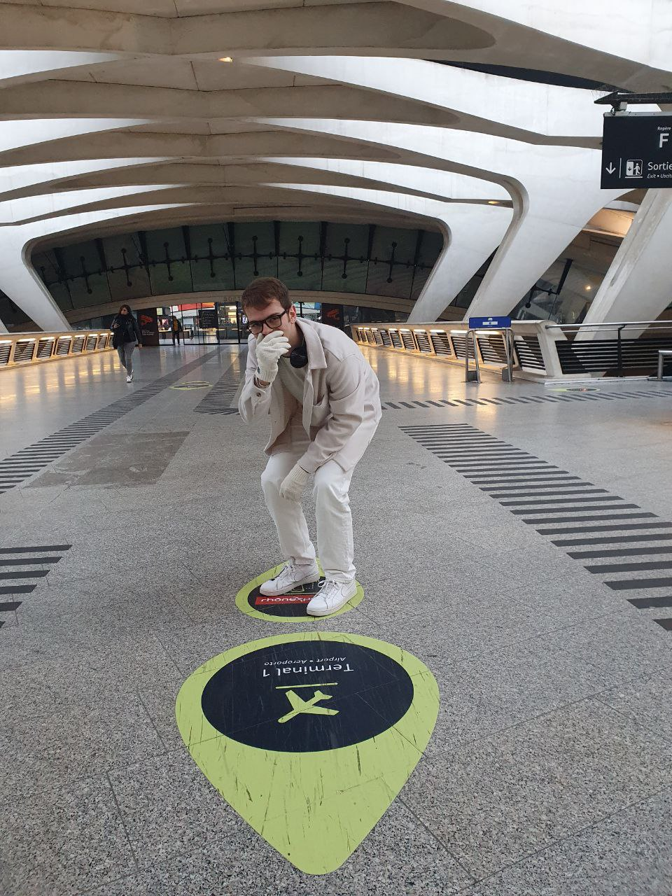

Solved by: @yappare

### Question:
Will you find where **Titto** was in one of his adventures?

the flag is the name of the location, with the spaces replaced by '_', the letters should be only lower ascii ones (in case of letters like 'è', put 'e') then all wrapped by TRX{} (example: "Naples International Airport" is "TRX{naples_international_airport}")

Challenge Image:

### Solution:

**Flag:** `TRX{lyon-saint_exupery_airport}`

